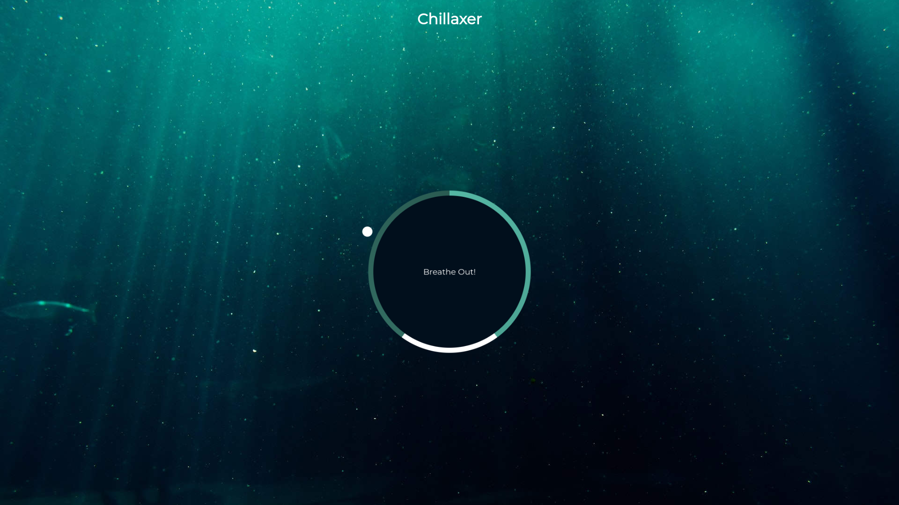

<h1><b>Chillaxer App</b></h1>

A mediation app with a breathing visual to tell you when to breathe in, hold and breathe out

</h1>

## Project Details

- Create circle and gradient circle with CSS
- Create and animate pointer (small circle)
- Create grow and shrink animations
- Create the breath animation effect with JavaScript
