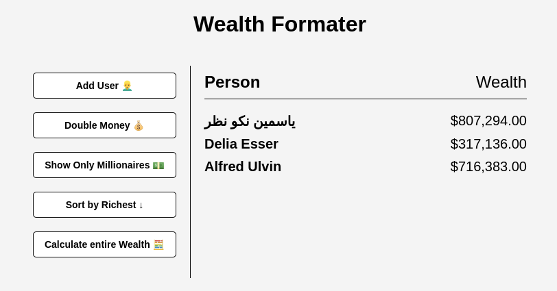

<h1><b>Wealth Formater App</b></h1>

A app to format wealth of users

</h1>

## Project Details

- Fetch random users from the randomuser.me API
- Use forEach() to loop and output user/wealth
- Use map() to double wealth
- Use filter() to filter only millionaires
- Use sort() to sort by wealth
- Use reduce() to add all wealth
